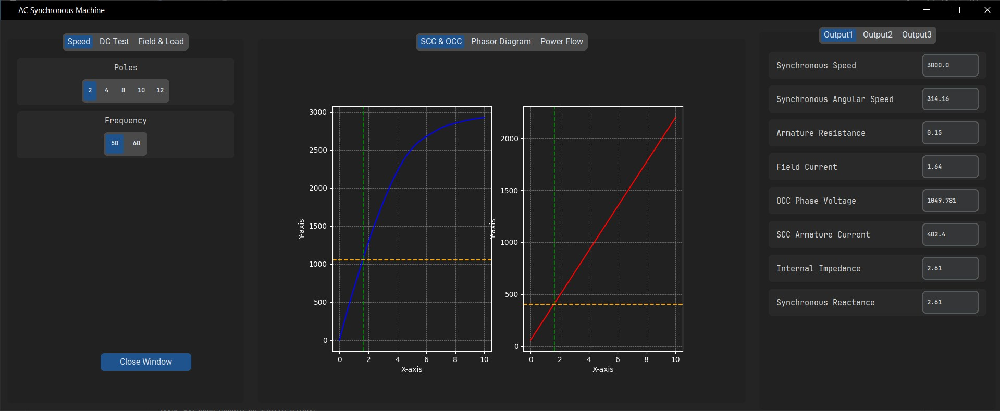
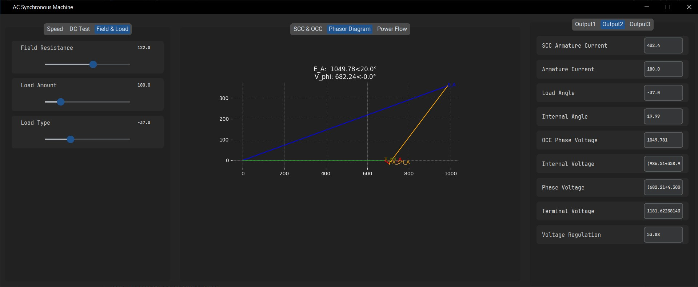

# EEE-3002. Electric Machines Project

## AC Synchronous Machine Calculator GUI with Tkinter
- load SCC and OCC data from csv, txt. 
- adjust field resistance for desired internal generated voltage
- examine resulting phasor diagram
- observe ouput variation with load amount and type
- apply dc-test, no-load test
- find approximate power input, output, losses and efficiency
- estimate torque
- updates dynamically

### *Unfinished Prototype

    

    

